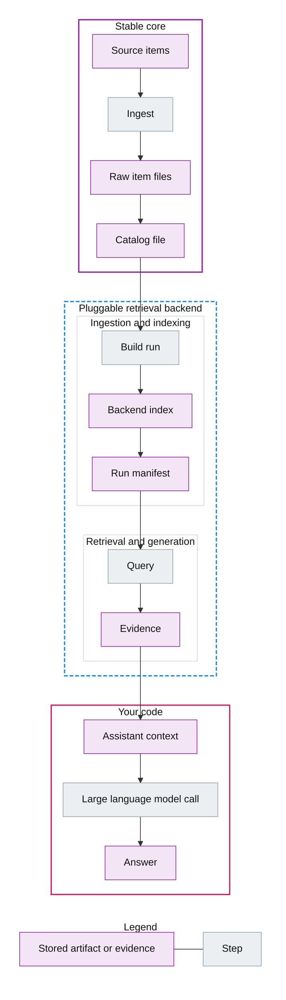

# Biblicus

![Continuous integration][continuous-integration-badge]
![Coverage][coverage-badge]

Make your documents usable by your assistant, then decide later how you will search and retrieve them.

If you are building an assistant in Python, you probably have material you want it to use: notes, documents, web pages, and reference files. A common approach is retrieval augmented generation, where a system retrieves relevant material and uses it as evidence when generating a response.

The first practical problem is not retrieval. It is collection and care. You need a stable place to put raw items, you need a small amount of metadata so you can find them again, and you need a way to evolve your retrieval approach over time without rewriting ingestion.

This library gives you a corpus, which is a normal folder on disk. It stores each ingested item as a file, with optional metadata stored next to it. You can open and inspect the raw files directly. Any derived catalog or index can be rebuilt from the raw corpus.

It integrates with LangChain, Tactus, Pydantic AI, and the agent development kit. Use it from Python or from the command line interface.

See [retrieval augmented generation overview] for a short introduction to the idea.

## The framework

The framework is a small, explicit vocabulary that appears in code, specifications, and documentation. If you learn these words, the rest of the system becomes predictable.

- Corpus is the folder that holds raw items and their metadata.
- Item is the raw bytes of a document or other artifact, plus its source.
- Catalog is the rebuildable index of the corpus.
- Evidence is what retrieval returns, ready to be turned into context for a large language model.
- Run is a recorded retrieval build for a corpus.
- Backend is a pluggable retrieval implementation.
- Recipe is a named configuration for a backend.
- Pipeline stage is a distinct retrieval step such as retrieve, rerank, and filter.

## Diagram

This diagram shows how a corpus becomes evidence for an assistant.
The legend shows what the border styles and fill styles mean.
The your code region is where you decide how to turn evidence into context and how to call a model.



## Practical value

- You can ingest raw material once, then try many retrieval approaches over time.
- You can keep raw files readable and portable, without locking your data inside a database.
- You can evaluate retrieval runs against shared datasets and compare backends using the same corpus.

## Typical flow

- Initialize a corpus folder.
- Ingest items from file paths, web addresses, or text input.
- Reindex to refresh the catalog after edits.
- Build a retrieval run with a backend.
- Query the run to collect evidence and evaluate it with datasets.

## Install

This repository is a working Python package. Install it into a virtual environment from the repository root.

```
python3 -m pip install -e .
```

After the first release, you can install it from Python Package Index.

```
python3 -m pip install biblicus
```

## Quick start

```
biblicus init corpora/example
biblicus ingest --corpus corpora/example notes/example.txt
echo "A short note" | biblicus ingest --corpus corpora/example --stdin --title "First note"
biblicus list --corpus corpora/example
biblicus build --corpus corpora/example --backend scan
biblicus query --corpus corpora/example --query "note"
```

## Python usage

From Python, the same flow is available through the Corpus class and backend interfaces. The public surface area is small on purpose.

- Create a corpus with `Corpus.init` or open one with `Corpus.open`.
- Ingest notes with `Corpus.ingest_note`.
- Ingest files or web addresses with `Corpus.ingest_source`.
- List items with `Corpus.list_items`.
- Build a retrieval run with `get_backend` and `backend.build_run`.
- Query a run with `backend.query`.
- Evaluate with `evaluate_run`.

## How it fits into an assistant

In an assistant system, retrieval usually produces context for a model call. This library treats evidence as the primary output so you can decide how to use it.

- Use a corpus as the source of truth for raw items.
- Use a backend run to build any derived artifacts needed for retrieval.
- Use queries to obtain evidence objects.
- Convert evidence into the format your framework expects, such as message content, tool output, or citations.

## Learn more

The documents below are written to be read in order.

- [Architecture][architecture]
- [Corpus][corpus]
- [Text extraction][text-extraction]
- [Backends][backends]
- [Next steps][next-steps]
- [Testing][testing]

## Metadata and catalog

Raw items are stored as files in the corpus raw directory. Metadata can live in a Markdown front matter block or a sidecar file with the suffix `.biblicus.yml`. The catalog lives in `.biblicus/catalog.json` and can be rebuilt at any time with `biblicus reindex`.

## Corpus layout

```
corpus/
  raw/
    item.bin
    item.bin.biblicus.yml
  .biblicus/
    config.json
    catalog.json
    runs/
      run-id.json
```

## Retrieval backends

Two backends are included.

- `scan` is a minimal baseline that scans raw items directly.
- `sqlite-full-text-search` is a practical baseline that builds a full text search index in Sqlite.

## Integration corpus and evaluation dataset

Use `scripts/download_wikipedia.py` to download a small integration corpus from Wikipedia when running tests or demos. The repository does not include that content.

The dataset file `datasets/wikipedia_mini.json` provides a small evaluation set that matches the integration corpus.

Use `scripts/download_pdf_samples.py` to download a small Portable Document Format integration corpus when running tests or demos. The repository does not include that content.

## Tests and coverage

```
python3 scripts/test.py
```

To include integration scenarios that download public test data at runtime, run this command.

```
python3 scripts/test.py --integration
```

## Releases

Releases are automated from the main branch using semantic versioning and conventional commit messages.

The release pipeline publishes a GitHub release and uploads the package to Python Package Index when continuous integration succeeds.

Publishing uses a Python Package Index token stored in the GitHub secret named PYPI_TOKEN.

## Documentation

Reference documentation is generated from Sphinx style docstrings. Build the documentation with the command below.

```
sphinx-build -b html docs docs/_build
```

## License

License terms are in `LICENSE`.

[retrieval augmented generation overview]: https://en.wikipedia.org/wiki/Retrieval-augmented_generation
[architecture]: docs/ARCHITECTURE.md
[corpus]: docs/CORPUS.md
[text-extraction]: docs/EXTRACTION.md
[backends]: docs/BACKENDS.md
[next-steps]: docs/NEXT_STEPS.md
[testing]: docs/TESTING.md

[continuous-integration-badge]: https://github.com/AnthusAI/Biblicus/actions/workflows/ci.yml/badge.svg?branch=main
[coverage-badge]: https://img.shields.io/endpoint?url=https://raw.githubusercontent.com/AnthusAI/Biblicus/main/coverage_badge.json
