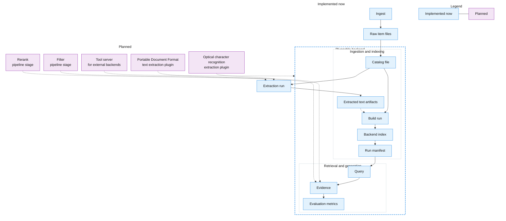

# Next steps

This document is a menu of options for what to build next, plus practical commands you can run to see the current system working end to end.

The goal is to keep one clear reference point for planning and prioritization.

## Diagram of the current system and the next layers

Blue boxes are implemented now. Purple boxes are planned next layers that we can build and compare.



## Working examples you can run now

### Install for local development

From the repository root:

```
python3 -m pip install -e ".[dev]"
```

### Create a corpus and ingest a few items

```
rm -rf corpora/demo
python3 -m biblicus init corpora/demo

python3 -m biblicus ingest --corpus corpora/demo --note "Hello from a note" --title "First note" --tags "demo,notes"

printf "A tiny text file\n" > /tmp/biblicus-demo.txt
python3 -m biblicus ingest --corpus corpora/demo /tmp/biblicus-demo.txt

python3 -m biblicus ingest --corpus corpora/demo https://example.com

python3 -m biblicus list --corpus corpora/demo
```

### Show an item

Copy an item identifier from the list output, then run:

```
python3 -m biblicus show --corpus corpora/demo ITEM_ID
```

### Edit raw files and reindex

The catalog is rebuildable. You can edit raw files or sidecar metadata, then refresh the catalog.

```
python3 -m biblicus reindex --corpus corpora/demo
```

### Build an extraction run

Text extraction is a separate pipeline stage from retrieval. An extraction run produces derived text artifacts under the corpus.

This extractor reads text items and skips non-text items.

```
python3 -m biblicus extract --corpus corpora/demo --extractor pass-through-text
```

Copy the `run_id` from the JavaScript Object Notation output. You will use it as `EXTRACTION_RUN_ID` in the next command.

### Build and query the minimal backend

The scan backend is a minimal baseline that reads raw items directly.

```
python3 -m biblicus build --corpus corpora/demo --backend scan
python3 -m biblicus query --corpus corpora/demo --query "Hello"
```

### Build and query the practical backend

The sqlite full text search backend builds a local index under the run directory.

```
python3 -m biblicus build --corpus corpora/demo --backend sqlite-full-text-search --config extraction_run=pass-through-text:EXTRACTION_RUN_ID
python3 -m biblicus query --corpus corpora/demo --query "tiny"
```

### Evaluate a run against a dataset

The repository includes a small dataset that matches the Wikipedia integration corpus.

```
python3 -m biblicus eval --corpus corpora/demo --dataset datasets/wikipedia_mini.json
```

If you want the matching corpus content, download it first into a separate corpus.

```
rm -rf corpora/wikipedia
python3 scripts/download_wikipedia.py --corpus corpora/wikipedia --limit 5 --force
python3 -m biblicus build --corpus corpora/wikipedia --backend sqlite-full-text-search
python3 -m biblicus eval --corpus corpora/wikipedia --dataset datasets/wikipedia_mini.json
```

### Run the test suite and view coverage

```
python3 scripts/test.py
open reports/htmlcov/index.html
```

To include integration scenarios that download public test data at runtime:

```
python3 scripts/test.py --integration
```

## Menu of build options

Each option below is phrased as a user visible behavior. If we decide to build it, the next step is to write behavior driven development scenarios that describe it.

This roadmap is intentionally biased toward corpus management, because the day to day work of collecting and curating a corpus is the foundation for everything else.

This project uses strict behavior driven development. Feature specifications and Sphinx style documentation are treated as first class outputs, and the goal is complete specification coverage of behavior.

See `docs/CORPUS_WORKFLOWS.md` for design decisions about corpus management and lifecycle hooks.

Reference documentation for what exists today:

- `docs/CORPUS.md`
- `docs/EXTRACTION.md`
- `docs/TESTING.md`

### Corpus workflows

- Extend ingest from a web address with better filename and media type handling for difficult pages and redirects
- Import a folder tree into a corpus while preserving a stable source path
- Crawl a website under a base address and ingest discovered pages
- Deduplicate items by content hash to avoid repeated ingestion
- Add a corpus level ignore list for files and paths that should not be ingested
- Support large binary items with streaming write and checksum verification
- Provide first class commands for archive, prune, and export workflows
- Provide a corpus status command that reports size, newest items, and obvious problems

### Corpus management and lifecycle hooks

- Define lifecycle hooks so plugins can transform and curate items during ingestion and catalog rebuilds
- Support an editorial pipeline for filtering and pruning a corpus without destroying raw source material
- Support metadata enrichment steps that can be applied consistently across many items
- Provide a strict, documented hook protocol so the same plugin can target multiple hook points
- Provide a safe way to record what changed when hooks run, to support reproducibility and trust
- Keep hook interfaces typed and validated with Pydantic models

### Metadata workflows

- Provide first class commands to edit tags and title without manual file edits
- Provide first class commands to attach or update sidecar metadata
- Define a minimal, strict metadata schema for common fields while still allowing free form metadata
- Add a metadata validation command that explains why a file or sidecar is invalid

### Text extraction as pipeline stages

- Extract text from Portable Document Format files into a derived text artifact
- Extract text from office document formats into a derived text artifact
- Extract text from images with optical character recognition into a derived text artifact
- Define a pipeline stage interface so these steps are pluggable and testable
- Define extraction runs as a separate plugin stage from retrieval so extraction providers and retrieval providers can be combined freely
- Store derived artifacts under the corpus, partitioned by plugin type and identifier, so multiple implementations can coexist side by side

### Retrieval and evidence

- Add a second retrieval stage that reranks evidence from a first stage
- Add a filtering stage that applies tags, sources, or metadata predicates
- Add evidence formatting utilities for common assistant frameworks
- Add evidence provenance utilities that make citations easy and consistent

### Evaluation and datasets

- Add a dataset authoring command that helps create small, human curated evaluation sets
- Add evaluation reports that include per query diagnostics and summary tables
- Add regression checks so evaluation results can be compared across runs
- Add dataset loaders for common sources while keeping the on disk schema stable
- Add extraction evaluation datasets that measure extracted text quality for images and Portable Document Format pages
- Add extraction evaluation metrics for accuracy, speed, and cost, recorded per item and aggregated by run

### Plug in architecture

- Define a plugin discovery mechanism for third party backends
- Define a stable tool schema for external tool execution
- Define a minimal server process that exposes the tools over the Model Context Protocol

### Documentation and developer experience

- Provide a short tutorial that starts from zero and ends with an evaluated retrieval run
- Add a reference page that defines the vocabulary with examples
- Add a cookbook with small patterns, each backed by behavior driven development scenarios

## Decision factors

When we choose what to build next, these are the main considerations to weigh.

### Learning value

- Does the feature teach the framework vocabulary and reinforce the mental model
- Does it make it easier to experiment with different retrieval designs

### Practical value

- Does it remove friction for a Python engineer building an assistant system
- Does it reduce time spent managing files and metadata by hand

### Portability and durability

- Does the raw corpus remain readable with ordinary operating system tools
- Can a user back up the corpus by copying a folder

### Reproducibility

- Does the feature make runs and evaluation results easier to reproduce
- Does it keep derived artifacts clearly separated from raw items

### Cost and complexity

- Does the feature add dependencies that are hard to install
- Does it require a service process or can it run as a local library

## Suggested next iteration

If you want a focused next step that delivers visible value without adding heavy dependencies, the best next move is an extraction plugin stage that produces derived text artifacts for Portable Document Format and image items, plus a retrieval policy that can prefer extracted text when it exists.

This reinforces the core separation between raw items, derived artifacts, and retrieval evidence, and it makes the system immediately more useful for real world documents. It also makes it possible to evaluate multiple extraction providers against the same corpus and the same retrieval backend.
